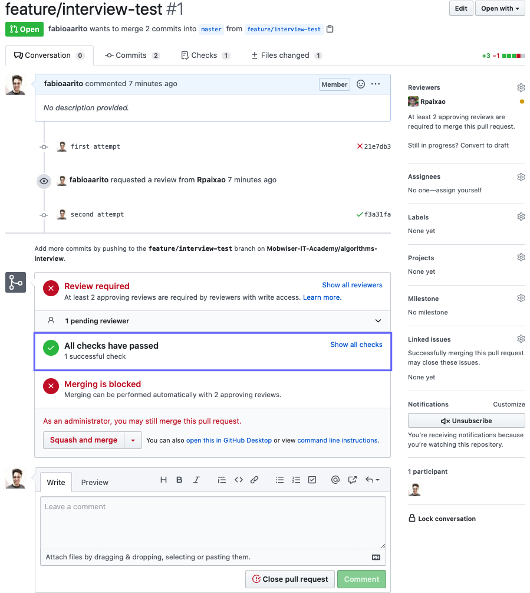

# Technical interview - Algorithms questions

This repository should be used as a mock technical interview. Here you will be able to practice some
algorithm questions typically used by companies in their interviews for junior developers.

## How to go through the interview
1. Create a git branch based on the master branch called interview-<your_name> (example: interview-fabio-rito)
    * Inside this repository you have a "questions" directory. Each question has an index.js file with an
algorithm challenge. Typically, each challenge contains 2 functions:
    * The first function is the function you should change in order to solve the challenge
    * The "exercice" function is the function responsible to evaluate the first function. You can change the input
value so that you can test your function through multiple inputs.
    * You can open the index.html file in the browser in order to check whether you solve all exercices sucessfully
1. After you complete the interview create a PR. This PR will automatically run a script that will validate your interview. 
    * If you have questions you can ask one Mobwiser mentor to review the PR and ask for help
1. After someone approves the PR you can delete it. These PR **won't be merged to the master branch**. The PRs will only be used as a way to provide some code review.

### FAQ

#### How do I know my PR is valid?

You have to ensure all checks have passed as showed in the image below.

## Browser support
* Chrome - last version
